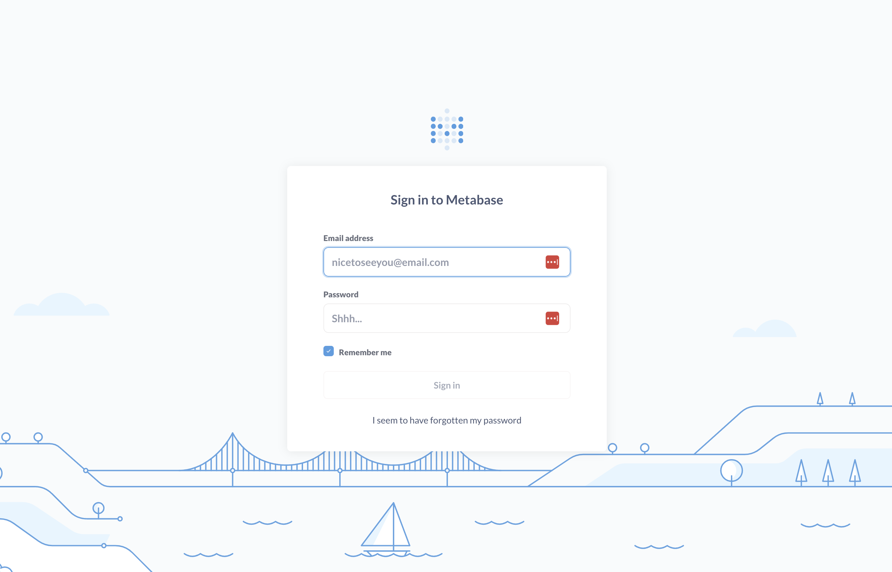

# Data Pipeline Project For Some Spotify Data

<details>
    <summary>Table of Contents</summary>
    <ol>
        <li>
            <a href="#introduction">Introduction</a>
            <ul>
                <li><a href="#built-with">Built With</a></li>
            </ul>
        </li>
        <li>
            <a href="#project-architecture">Project Architecture</a>
        </li>
        <li>
             <a href="#getting-started">Getting Started</a>
             <ul>
                <li>
                <a href="#create-a-google-cloud-project">Create a Google Cloud Project<a>
                </li>
                <li>
                <a href="#set-up-kaggle">Set up Kaggle<a>
                </li>
                <li>
                    <a href="#set-up-the-infrastructure-on-GCP-with-terraform">Set up the infrastructure on GCP with Terraform</a>
                </li>
                <li>
                    <a href="#set-up-airflow-and-metabase">Set up Airflow and Metabase</a>
                </li>
            </ul>
        </li>
        <li>
            <a href="#data-ingestion">Data Ingestion</a>
        </li>
        <li>
            <a href="#data-transformation">Data Transformation</a>
        </li>
        <li>
            <a href="#data-visualization">Data Visualization</a>
        </li>
        <li>
            <a href="#contact">Contact</a>
        </li>
         <li>
            <a href="#acknowledgments">Acknowledgments</a>
        </li>
    </ol>
</details>

## Introduction

This project is a vital aspect of the [2024 Data Engineering Zoomcamp curriculum](https://github.com/DataTalksClub/data-engineering-zoomcamp). Within this project, I constructed a data pipeline tasked with loading and processing data retrieved from a Kaggle dataset, which includes 2023 Spotify data. Access to the dataset is accessible on [Kaggle](https://www.kaggle.com/datasets/tonygordonjr/spotify-dataset-2023).

This dataset comprises an API extraction encompassing various aspects of artists, including details about their music, genres, albums, tracks, and audio features. The dataset consists of four files: Album.csv, which contains information about the albums created by the artists; Artist.csv, which provides comprehensive details about the artists; Feature.csv, which includes the audio features of the tracks; and Track.csv, which contains details about the tracks and their popularity. For more information, please Kaggle

What is the objective of this project? The objective is to construct a data pipeline that retrieves, stores, cleans, and presents the data through a straightforward dashboard for visualization. With this objective in mind, we can analyze various aspects such as the types of albums preferred by certain artists, the number of track releases over the years, albums with a high number of tracks, artists with a significant volume of tracks, and the audio features of all tracks in the dataset, among others.

### Built With

- Dataset repo: [Kaggle](https://www.kaggle.com)
- Infrastructure as Code: [Terraform](https://www.terraform.io/)
- Workflow Orchestration: [Airflow](https://airflow.apache.org)
- Data Lake: [Google Cloud Storage](https://cloud.google.com/storage)
- Data Warehouse: [Google BigQuery](https://cloud.google.com/bigquery)
- Transformation: [DBT](https://www.getdbt.com/)
- Visualisation: [Metabase](https://www.metabase.com/)
- Programming Language: Python and SQL

## Project Architecture


The cloud infrastructure has been established using Terraform, while Airflow is being executed within a local Docker container.

## Getting Started

### Prerequisites

1. A [Google Cloud Platform](https://cloud.google.com/) account.
2. A [kaggle](https://www.kaggle.com/) account.
3. Install VSCode or [Zed](https://zed.dev/) or any other IDE that works for you.
4. [Install Terraform](https://www.terraform.io/downloads)
5. [Install Docker Desktop](https://docs.docker.com/get-docker/)
6. [Install Google Cloud SDK](https://cloud.google.com/sdk)
7. Clone this repository onto your local machine.

### Create a Google Cloud Project

- Go to [Google Cloud](https://console.cloud.google.com/) and create a new project.
- Retrieve the project ID and define the environment variable `GCP_PROJECT_ID` in the .env file located in the root directory.
- Create a [Service account](https://cloud.google.com/iam/docs/service-account-overview) with the following roles:
  - `BigQuery Admin`
  - `Storage Admin`
  - `Storage Object Admin`
  - `Viewer`
- Download the Service Account credentials and store it in `$HOME/.google/credentials/`.
- You need to activate the following APIs [here](https://console.cloud.google.com/apis/library/browse)
  - Cloud Storage API
  - BigQuery API
- Assign the `GOOGLE_APPLICATION_CREDENTIALS` environment variable to the path of your JSON credentials file, such that `GOOGLE_APPLICATION_CREDENTIALS` will be $HOME/.google/credentials/<authkeys_filename>.json
  - add this line to the end of the `.bashrc` file
  ```bash
  export GOOGLE_APPLICATION_CREDENTIALS=${HOME}/.google/google_credentials.json
  ```
  - Activate the enviroment variable by runing `source .bashrc`

### Set up kaggle

- A detailed description on how to authenicate is found [here](https://www.kaggle.com/docs/api)
- Specify the environment variables `KAGGLE_USER` and `KAGGLE_TOKEN` in the .env file situated in the root directory. Please note that `KAGGLE_TOKEN` is interchangeable with `KAGGLE_KEY`.

### Set up the infrastructure on GCP with Terraform

- Using either Zed or VSCode, open the cloned project `DE-2024-project-spotify`.
- To customize the default values of `variable "project"` and `variable "region"` to your preferred project ID and region, you have two options: either edit the variables.tf file in Terraform directly and modify the values, or set the environment variables `TF_VAR_project` and `TF_VAR_region`.
- Open the terminal and navigate to the root directory of the project.
- Change the directory to the terraform folder by running the command `cd terraform`.
- Set an alias with the command `alias tf='terraform'`.
- Initialise Terraform by executing `tf init`.
- Plan the infrastructure using `tf plan`.
- Apply the changes with `tf apply`.

### Set up Airflow and Metabase

- Please confirm that the following environment variables are configured in `.env` in the root directory of the project.
  - `AIRFLOW_UID`. You can use run `echo -e "AIRFLOW_UID=$(id -u)" > .env` on your CLI
  - `KAGGLE_USERNAME`. This should be set from [Set up kaggle](#set-up-kaggle) section.
  - `KAGGLE_TOKEN`. This should be set from [Set up kaggle](#set-up-kaggle) section too
  - `GCP_PROJECT_ID`. This should be set from [Create a Google Cloud Project](#create-a-google-cloud-project) section
  - `GCP_SPOTIFY_BUCKET=spotify_project_datalake_<GCP project id>`
  - `GCP_SPOTIFY_WH_DATASET=spotify_warehouse`
  - `GCP_SPOTIFY_WH_EXT_DATASET=spotify_warehouse_ext`
- Run `docker-compose up`.
- Access the Airflow dashboard by navigating to `http://localhost:8080/` in your web browser. The interface will appear similar to the following screenshot. Log in using `airflow` as the username and password.


- To access the Metabase dashboard, open your web browser and visit `http://localhost:1460`. The interface will look similar to the following screenshot. You will need to sign up to use the UI.



## Data Ingestion

Once you've completed all the steps outlined in the previous section, you should now be able to view the Airflow dashboard in your web browser. Below, you'll see a list of DAGs available.

Below is the DAG's graph.

To run the DAG, Click on the play button


## Data Transformation

- Navigate to the root directory of the project in the terminal, and then change the directory to the "data_dbt" folder using the command `cd data_dbt`.
- Create a "profiles.yml" file within `${HOME}/.dbt`, and define a profile for this project according to the instructions provided below.

```yaml
data_dbt_spotify:
  outputs:
    dev:
      dataset: spotify_warehouse
      fixed_retries: 1
      keyfile: <location_google_auth_key>
      location: <preferred project region>
      method: service-account
      priority: interactive
      project: <preferred project id>
      threads: 6
      timeout_seconds: 300
      type: bigquery
  target: dev
```

- To run all models, run `dbt run -t dev`
- Navigate to your Google [BigQuery](https://console.cloud.google.com/bigquery) project by clicking on this link. There, you'll find all the tables and views created by DBT.
  

## Data Visualization

Please watch the [provided video tutorial](https://youtu.be/BnLkrA7a6gM&) for guidance on configuring your Metabase database connection with BigQuery. You can customize your dashboard to suit your preferences. Additionally, you can view the complete screenshot of the dashboard I created in this [PDF](./screenshots/DE_2024_spotify_1.pdf).


## Contact

Twitter: [@iamraphson](https://twitter.com/iamraphson)

## Acknowledgments

I want to express my deepest appreciation to the organizers, especially [Alex](https://www.linkedin.com/in/agrigorev/), for offering the [Data Engineering Zoomcamp](https://github.com/DataTalksClub/data-engineering-zoomcamp) course. It has been an incredibly valuable learning experience for me.

🦅
